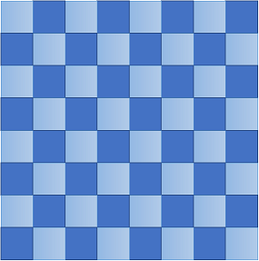
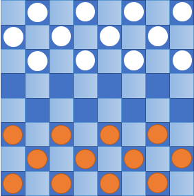
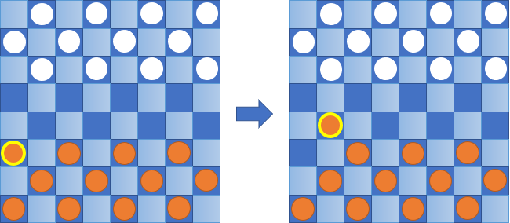
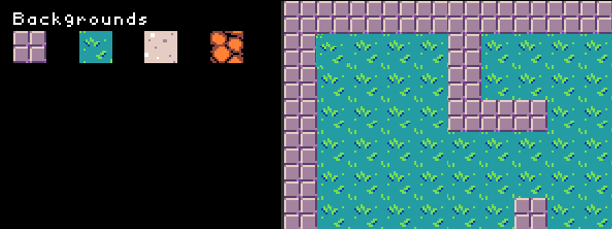

# From Board Games to TileCode Games

Board games like checkers (also known as draughts) have been played for thousands of years of human history. Checkers and chess are both played on a **board** with 64 **squares** arranged in an 8x8 two-dimensional **grid**. The squares are alternating colored in each row and column, created a checkered pattern:

 
Game **pieces** are placed in their initial **positions** on the squares of the board and game play begins, such as in checkers:

Each player takes a **turn**, which consists of moving a single piece on the board from its square to another square, and possibly removing other pieces. The rules of the game (checkers, chess, etc.) define the **legal moves** that a piece is permitted, given the type of the piece and the current positions of the pieces on the board (also called the **state** of the board).  For example, in checkers, a piece may be moved diagonally into an adjacent unoccupied square:

## Tile Maps (Boards)

TileCode video games are similar to board games. 
A TileCode game takes place on a **tile map**, which is similar to the board in a board game. 
Like the squares of a board, the **tiles** of a tile map are arranged in a grid. 

A tile map visually represents a scene in which the action of the game takes place. The tile backgrounds may represent entities such as barriers (walls), pathways, etc. 
Here is part of a tile map that uses just two backgrounds from the four available in TileCode:

The main differences of a tile map compared to a board are:
- a tile map can be much larger than a chess or checker board, and does not need to be square
- each tile can be ``painted’’ with **background** art, chosen from a gallery of artwork
- a tile's background art can be changed during the game. 

It’s easy to create your own physical tile map using construction paper (of assorted colors) and scissors, or with color pencils/marks and paper. A large set of paper tiles of various colors will allow for a lot of 2D creativity on a table and topic for discussion and collaboration.

## Sprites (Pieces)

Board games feature pieces, which are **movable** objects. 
Each piece may have a different **form**, signifying its kind and capabilities.
In chess, pieces are of six kinds (king, queen, knight, bishop, rook, pawn) and
the legal moves for a piece are determined by its kind and the current state of the
board. Each piece that is ``in play'' occupies a single square of the board. 
In most board games, there is at most one piece in a square, though in checkers, 
one may "crown" a checker with another checker to create a king, which has the 
capability  to move backward as well as forward. 

In TileCode games, sprites are the digital counterparts of pieces. 
* kind
* position

Sprite Actions:
* move
* destroy
* create

