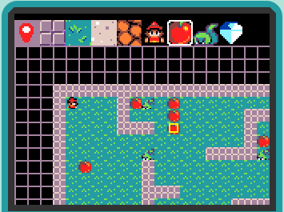
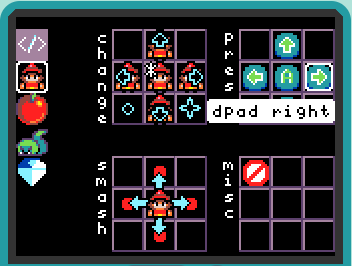
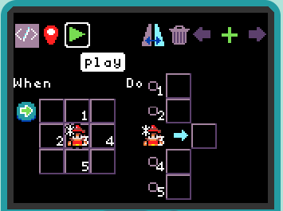
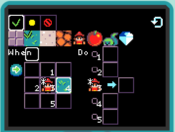
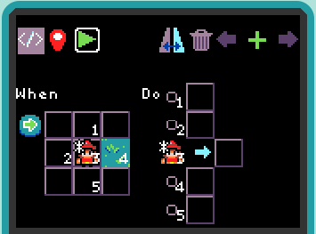
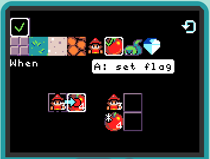
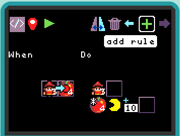
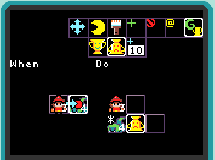

# Hello World Game

TileCode programming takes place by creating a set of rules that describe sprite behavior. Let’s start with a fresh game example. Go to the load screen and select game slot #1 which will open the "Hello World" game. If you play the game, you’ll see that you can move the player sprite around with the direction pad. The goal is to eat as many apples as possible while avoiding the snakes. 

## Creating the "Hello World" game

Let’s learn how we can create this game, step by step. Back up to the load screen. Game slot #2 should be available (purple color), so select that one to create a new game. (If there is no available slot, you will need to delete an existing game to make space for a new one. To delete a game, first go to one of the existing slots and select it to go to the game's home screen; then select the settings wheel and select the "delete" button. Press **A** to confirm that you want to delete the game). 

## Step 1: Pick your game characters (sprites)

Select the player, the apple and the snake from the gallery for your game. Pick any tiles you like for the terrain. 

## Step 2: Build your game level/map

For this step you will need to go to the map editor. Here you can select any tile background or sprite you prefer and place it on the board. In the case of our "Hello World" game we want the player sprite to avoid the walls, walk on grass, pick apples and avoid snakes so we will build our game board to support that scenario. 

Here we have selected the apple sprite and place a few more apple sprites on the map:

Make sure to place a player sprite on the map as well (see it in the upper left of the tile map above).

## Step 3: Make the player move. 

Now let's create our first game rule and bring the player sprite to life. Navigate to the rule selector screen. Select the **dpad right** button from the **press** rules, as shown below:

This will bring up the rule editor for the player sprite on the dpad-right press, as shown below in the **When** section. For the **Do** action add a move right command by selecting the tile to the right of the player sprite in the **Do** section. This will bring up the command menu (shown at the top). Navigate to select the blue right arrow and then press **B** to dismiss the command menu.

After dismissing the command menu, select the play button as shown below:

This will allow you to see the effect of the rule you just created - you can move the player sprite anywhere on the board (for the player sprite, TileCode will automatically generalize the rule to all four directions).

## Step 4: React to the board

Press the **B** button to return to the rule editor. We will now modify the rule so that the player can only walk on grass tiles. In the **When** section, select the tile to the right of the player sprite and add the grass tile by putting a green check mark on the grass background, as shown below. The **Do** section will not change.

Press the **B** button to exit the menu:

Again, select the play button to see the effect of the change to the rule. 

## Step 5: Let's eat the apples.

In order for the player to be able to eat the apples we need to create a smash rule. Return to the rule selector screen and choose one of the red dot tiles in the **smash** section, as shown below:

In the rule editor, select the red dot tile in the **When** section and add an apple sprite to show we want to create a rule for when the player is meeting with (smashing into) the apple:

For the **Do** section we will not have any action for the player; for the apple we will have a destroy action (yellow pacman) and  add a 10 points action so the player gets more points with more apples. 

## Step 6: Don't step on a snake! 

We need to create a new smash rule for the case when a player steps on a snake. A new smash rule can be created directly from the rule editor for the smash-into-apple rule by selecting the the **+** tile in the upper right:

For the **When** section, select the red dot tile and add a snake sprite to show that the player is colliding into the snake. We will not have any action for the player. For the snake we will have a game-lost action (yellow upside-down trophy) which will trigger a **game over** event. 

