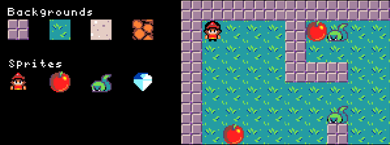
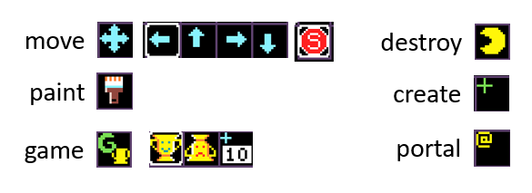

# Programming Model

## State

A TileCode state consists of a tile map populated with sprites. Each tile has one of four possible backgrounds, which can change during
program execution. A tile may contain zero, one or more sprites. There are four kinds of sprites as well, as shown below:

A sprite's kind is fixed for the lifetime of the sprite (from creation to destruction). A sprite has a direction 
(up, down, left, right, resting), indicating the way the sprite moved between rounds, or if it remained at rest.

## Rounds

A TileCode game proceeds in **rounds**: each round executes all rules in parallel on the current state to determine 
the direction that each sprite should next take, which sprites should be 
created and/or destroyed, etc. After a round, the commands are executed by the TileCode game engine from the current the state 
(all sprites move synchronously and at the same speed) to determine the next state. A sprite stores the direction 
(left, right, up, down) it moved in the last round (or if it remained at rest), for inspection by the rules in the next round.
A sprite can move at most one tile per round.

## Sprite Kinds

Sprite kinds are ordered from left to right as shown above (and on the game home screen, tile map editor, etc.).
The first sprite usually represents the player avatar. By default, the camera follows the first sprite as it moves
around the tile map during game play. Furthermore, all rules created for the first sprite are automatically generalized 
to all four directions (this can be changed by the user, as explained later.) Finally, the z-depths of the sprites are 
assigned so that the first sprite is on top of all other sprites, the second sprite is on top of the third 
and fourth sprites, etc.

## Center Sprites

A TileCode **rule** applies to one or more **center sprites**, 
namely those that appear in the center tile of the rule's 3x3 **When** section.
If you select the center tile of the When section, the sprites with green check marks are the ones to which
the rule applies. If there are no sprites with green check marks, the rule will not run (rules cannot yet apply to a tile
by itself). When you visit the rule selector screen, you can choose among the four sprite kinds. When you create a new rule 
from this screen, the currently selected sprite will be the center sprite of the new rule.  You can change which sprite a 
rule applies to by selecting the center tile of the When section.

## Events

There are three basic kinds of events in TileCode: button **press**, neighborhood **change**, and sprite **smash**
(there are also some important **miscellaneous** events).

### Button Press Event

During game play, the TileCode game engine raises five button press events: **A button**, **dpad-left**, **dpad-right**, 
**dpad-up**, **dpad-down**.  If a press rule successfully fires (meaning that the **When** pattern of the rule matches, 
as defined later) for a sprite **S** in a round, then no change rule for S will be fired in that round. That is, press 
rules shadow change rules, prioritizing events from the user over internal events. 

### Neighborhood Change Event

If the 3x3 neighborhood of a sprite changed due to a command in the previous round, a change event is raised for the current round and
all applicable change rules for the sprite are fired. A 3x3 neighborhood changes in a round if any one the nine tiles 
**T** in the neighborhood registers one of the following changes:
- T's background art changed (due to a paint command)
- a sprite moved in to or out of tile T
- a sprite was created or destroyed at tile T
- a sprite came to rest at tile T (moved into tile T at the beginning of the round, but was not issued a move command in the round)

Change events are critical for creating non-player characters, animations, etc.

### Sprite Smash Event

After the press and change rules have fired, every sprite now has a new direction to move in (or will stay at rest - more on this later).
A **smash** event is raised within the same round if based on the proposed directions, a pair of sprites will collide with one another.
In the rule for a smash event, the center sprite has received a move command. The red dot in an adjacent tile represents a second sprite 
that the center sprite will collide with if the move command is executed. This second sprite may be in motion or at rest.

Common commands that are invoked on a smash event include:
- **destroy** - in this case, the center sprite usually is "consuming" the second sprite, to which the destroy command is sent.
- **stop** - cancel the move command on the center sprite
- **game over** - end the game

### Miscellaneous

#### Never Conditions

Many game progress/win conditions require that a predicate holds for every member of a set: 
- "the player goes to the next level when every diamond has been collected from the game board"

For these cases, we make use of **never** rules, which fire at the beginning of a round on the current 
state (before any other events and rules fire). The red "no-entry" circle signifies the never rule. 
A never rule fires successfully exactly when there is no 3x3 region of the tile map on which the When 
section fires successfully. 

## When-Do Rules

Having defined the concepts of **state**, **rounds**, **center sprites** and **events** in TileCode, we are now ready to discuss rules in more detail. As already seen, a TileCode rule is formed by a pair of a **When** predicate and **Do** commands. Rules fire in parallel on the current game state and events, 
which results in commands being sent to tiles/sprites; each tile/sprite stores a local log of the commands sent to it. A **resolution** step determines which of the (possibly conflicting) commands in each log will be executed. 
A new game state is produced by executing the commands.

### Tile Predicates

A **When** predicate is a predicate on the game state that examines the 
3x3 neighborhood around a sprite. More precisely, a **When** predicate is 
a *conjunction* of **tile predicates**, one for each of the nine tiles in a 
sprite's neighborhood, including the center tile. Most of these predicates will 
simply be ``true'', corresponding to a black tile, which means that no constraints are placed on that tile.  

A tile predicate is defined by three non-intersecting sets over the eight tile/sprite kinds:
- **Include**: the tile must contain at least one background/sprite whose kind is in this set 
and whose direction (in the case of a sprite) matches the direction predicate (discussed further below);
- **Include'**: the tile must contain at least one background/sprite whose kind is in this set;
- **Exclude**: the tile must not contain any of the backgrounds/sprites from this set.

A black tile's include and exclude sets all are empty. The Include set is denoted by green check marks; 
the Exclude set is denoted by the red "no-entry" circle sign; 
membership in the Include' set is denoted by a yellow dot. 

### Sprite Witnesses

If a tile predicate has a non-empty Include set that contains only sprite kinds then
the associated tile must contain a sprite if that predicate evaluates to true on a state. We call such a sprite a **sprite witness**, as it witnesses the truth of the predicate. Sprite witnesses are TileCode's form of variable binding. Sprite witnesses are displayed in the column to the right of the **Do** keyword, as discussed further below. Note that the Include' set does not bind a sprite witness. The four tiles adjacent to the center tile also may have sprite witnesses.  

### Correspondence Between When and Do Sections

There are five rows in the **Do** section in a one-to-one correspondence with the 
center tile and its four adjacent tiles in the **When** section. You can see this
correspondence by moving the cursor over the rows in the **Do** section, or the
five tiles in the **When** section. With help turned on, numbering of the rows
and tiles shows the correspondence, as shown below:

### Direction Predicates

If a tile predicate has identified a sprite witness, then we may wish to constrain the 
direction of that sprite. Selecting the sprite witness in the column to the right of 
the **Do** label, brings up the direction predicate menu, as shown below:

From left to the right, the direction predicates are: left, up, right, down, 
resting, moving, any (white asterisk).. The direction predicate is reflected in 
the tile predicate in the When section, 
as the predicate takes part in the pattern matching, as described previously. 

### Commands

TileCode commands come in three basic varieties: (1) commands that apply to sprites; 
(2) commands that apply to tiles; (3) all other commands.

Sprite-based commands are:
- **move**: move left, right, up, or down by one tile; stop/cancel move command (on a pending collision/smash event)
- **destroy**: remove the sprite

Tile-based commands are:
- **create**: creates a sprite at the given tile
- **paint**: paint the given tile with a background

The other commands are:
- **portal**: opens a portal to a random tile on the tile map
- **game**:  game lose, game win, increase score

The legend below shows the commands and their associated icons:

It's important to note that the **create** command creates a new sprite witness,
namely the sprite this created. Thus, one can send a sprite-based command (such as move)
to the newly-created sprite by placing that command immediately after the create
command.  Similarly, the **portal** command opens a portal to a new tile, so one
can place a tile-based command immediately after the portal command (such as paint or create).

### Resolution

When a rule successfully fires, the commands in the Do section of the rule are issued to the 
center tile/sprite as well as the four tile/sprites adjacent to the center. Each object 
(tile/sprite) maintains a log of the commands sent to it. 

After firing of press and change rules, 

## Parallelism, Conflicts and Non-Determinism

## Rule Generalization

