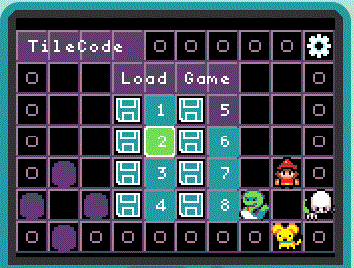
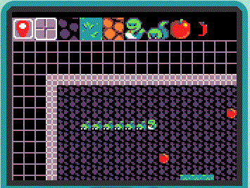
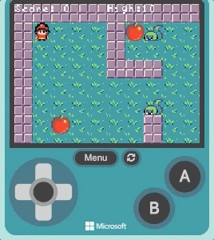

# TileCode App Overview

## Navigation and Editing {#navigation}
 
On a [MakeCode Arcade compatible device](https://arcade.makecode.com/hardware), 
such as the Meowbit shown above, navigation and editing takes place as follows:
* move the square-shaped cursor between nearby tiles using the direction pad (dpad); 
* select a tile using the **A** button to perform an action; 
* press the **B** button to take you back to the menu of the current screen or to the previous screen

When you are working with [Arcade simulator](https://microsoft.github.io/tilecode) 
in a web browser, you can use keyboard shortcuts:
* the **arrow keys** (left, right, up, down) replace the direction pad (alteranatively, you can use the 'A', 'D, 'W', and 'S' keys)
* the **space bar** replaces the A button
* the **enter key** replaces the B button

## Sharing Your TileCode Games

The easiest way to share a TileCode game you have created on an Arcade device is to copy 
the UF2 file from your device and share that file with a friend. The UF2 file includes the 
flash settings in which your games are stored. When your friend copies this UF2 file to 
their Arcade device, they will get the games you created. Please be aware that if your friend's 
Arcade device is not the same as yours, this may not work.

## Load Screen

The TileCode load screen lets you select one of eight games to program and play with 
(slots colored blue already have game assets):

All game assets (gameboard, images and code) are stored on the Arcade device, 
so your creations will remain even if you power the device off. Game assets are 
saved whenever you transition between screens. If you copy a UF2 file off your device, 
the game assets will be stored in the file. If you then copy this UF2 to a similar device, 
the games will get installed on that device. 

## Game Home Screen

The game's home screen displays after a game slot has been selected:

Each TileCode game has four kinds of tile backgrounds and four kinds of game characters 
to work with, as shown on the screen. We call these game characters **sprites**. You can 
visit the art gallery to change the background art or sprite art by selecting the 
background/sprite from the game home screen with the **A** button.

## Gallery

In the gallery, simply move to the artwork you wish and select it with the **A** button:

When you are done, use the **B** button to return to the game home screen.

## Menu bar

The menu bar of the game home screen has four main items in addition to the gear wheel (for game settings): 

The four menu items are:
* tile map editor (red map icon)
* paint (bitmap) editor (paint brush icon) 
* rule selector (</> icon)
* play game (green play icon)

## Map Editor

The map editor lets you design your game level by painting with tile backgrounds 
and placing sprites on tiles. Select one of the four backgrounds and move the 
cursor down to the map. Press **A** to paint a tile with the current background. 
Press **B** to return to the menu bar and select another background or sprite. 
After selecting a sprite, the **A** button will place the sprite on a tile, 
replacing the sprite that is there (or removing it if it is the same as the selected sprite). 

You can paint tiles quickly by holding down the **A** button while moving the cursor. 
The reset button (upper right) resets the camera to the upper left of the map.

## Paint Editor

The paint editor lets you change the art associated with a tile background or sprite.

 As with the map editor, select the tile/sprite whose art you want to change. Move the 
 cursor down to edit the bitmap (using the **A** button to apply the currently selected color). 
 Press **B** to move from the bitmap pane to the color selector (pressing **B** again will take 
 you back to the top menu).  Selecting a color will send the cursor back to the bitmap pane so 
 you can resume painting where you left off. 

## Rule Selector

The rule selector screen shows the four kinds of sprites on the left and the different types 
of rules available (**change, press, smash, miscellaneous**).  A tile is highlighted if there 
is a rule of that type present. Select a tile to create a new rule or visit an already present rule. 

## Rule Editor

A rule takes the form of a **When-Do** guarded command. The **When** guard is a predicate/pattern
over the 3x3 local neighborhood around the central sprite. When the guard matches on the tile map, 
the commands in the **Do** section execute. More details about programming rules are given below.

## Play

The play button runs the game in full screen mode, as shown below:

Press **B** to exit the game and return to the previous screen. 

## Settings

Once you get used to the features available in TileCode, you can turn off the help suggestions 
via the gear wheel on the game home screen, which takes you to the settings screen.

